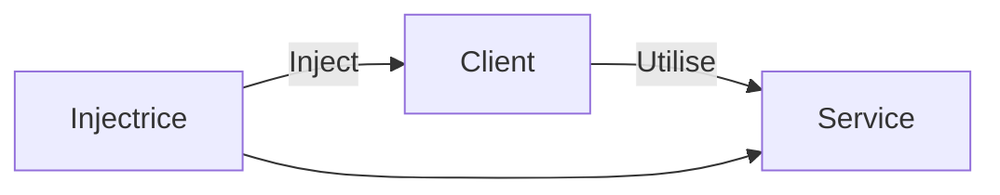
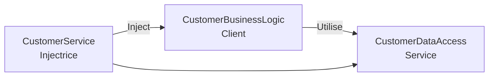
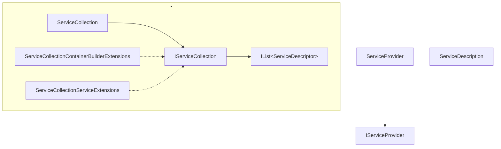

Principe:

On retire toutes les responsabilités autres que la responsabilité principale d'une classe pour respecter le principe de responsabilité unique.

Autres responsabilités:
- contrôle du flux d'une application
- contrôle de la creation
- contrôle de la liaison des objets dépendants

### Design principle = principe de conception

> Méthode de haut niveau
>>Plus des règles à suivre

### Design pattern = Modèle de conception (patron de concept)

>Solution d'implémentation de bas niveau
>>Manière d'implémenter un programme pour un problème spécifique


### Principe d'inversion de dépendance (DIP - Dependency Inversion Principle)

> 1. Les modules de haut niveau ne doivent pas dépendre des modules de bas niveau
> 2. Les deux doivent dépendre d'abstractions

### Injection de dépendance (DI - Dependency Injection)

>Modèle de conception qui implémente le principe d'inversion de contrôle d'objets dépendant

### Container d'inversion de contrôle

>Environnement qui permet de gérer automatiquement les injections de dépendance

# Inversion de contrôle

>Principe de conception

Contrôle = Toutes les responsabilités d'une classe autre que sa principal responsabilité

Objectifs:
- Code Testable
- Code Maintenable
- Code Extensible

### 1. Contrôle sur le flux du programme

Exemple:
	- Une application ou une interface graphique génère le flux du programme plutôt qu'une app de console ou le `Main` gère tout

### 2. Contrôle sur la création d'objet dépendant

Imaginons une classe dépend de l'instance d'une autre classe -> dépendance

Plutôt que d'instancier la dépendance dans la classe dépendante et donc avoir la responsabilité de la création et de la durée de vie, on va donner ces responsabilités à d'autres classes.

On peut utiliser le design pattern Factory qui va créer notre instance que l'on passera dans le constructeur de notre classe dépendante.

```cs
public class A
{
    B b;

    public A()
    {
        b = Factory.GetObjectOfB ();
    }

    public void Task1() {
        // do something here..
        b.SomeMethod();
        // do something here..
    }
}

public class Factory
{
    public static B GetObjectOfB() 
    {
        return new B();
    }
}
```

On a inversé(transféré) la dépendance de la classe A à la classe B.

Rappelons qu'un faible couplage veut dire que des changements dans une classe ne force pas les autres classes à changer:
	- Testable
	- Maintenable
	- Extensible

Exemple:

```cs
public class CustomerBusinessLogic
{
    DataAccess _dataAccess;
    
    public CustomerBusinessLogic()
    {
        _dataAccess = new DataAccess();
    }
    
    public string GetCustomerName(int id)
    {
        return _dataAccess.GetCustomerName(id);
    }
}

public class DataAccess
{
    public DataAccess()
    {
    }
    
    public string GetCustomerName(int id) {
        return "Dummy Customer Name"; // get it from DB in real app
    }
}
```

`CustomerBusinessLogic`dépend de `DataAcces`. Il crée l'objet `DataAccess` pour avoir accès aux données.

Problèmes:

1. Les deux classes ont un couplage étroit:
	- Un changement dans la classe `DataAcces` implique des changements dans `CustomerBusinessLogic`:
		Si on ajoute, supprime, renomme n'importe qu'elle méthode dans `DataAccess`, nous devrions nécessairement changer `CustomerBusinessLogic`.
2. Supposons que les données viennent de différentes bases de données ou de services en ligne dans le futur, nous aurions besoins de créer différentes classes et donc de changer la classe `CustomerBusinessLogic`.
3. `CustomerBusinessLogic` crée un objet `DataAccess`avec le mot clé `new`. Il pourrait y avoir plusieurs classes qui crée et utilise `DataAccess`, si l'on change `DataAccess`, il faudra faire ce changement dans toutes les classes dépendantes:
	- Répétitif
	- Difficile à maintenir
4. L'utilisation d'une classe concrète `DataAccess` ne permet pas de faire un test indépendant de `CustomerBusinessLogic` avec une classe de simulation.

Solution:
- Principe d'inversion de contrôle
-  Principe d'inversion de dépendance

Pattern utilisables (non-exhaustif) d'application du principe d'inversion de contrôle:
- Service Locator
- Factory
- Abstract Factory
- Template Method
- Strategy
- Injection de dépendances

Utilisons la Factory

```cs
public class DataAccessFactory
{
    public static DataAccess GetDataAccessObj() 
    {
        return new DataAccess();
    }
}
```

```cs
public class CustomerBusinessLogic
{

    public CustomerBusinessLogic()
    {
    }

    public string GetCustomerName(int id)
    {
        DataAccess _dataAccess =  DataAccessFactory.GetDataAccessObj();

        return _dataAccess.GetCustomerName(id);
    }
}
```

- Inversion de contrôle de la création de l'objet dépendance de `CustomerBusinessLogic` à `DataAccessFactory`.

Nous avons affaibli le couplage mais :
- Inversion de contrôle nécessaire mais pas suffisant
- Besoin du principe d'inversion de dépendances du pattern strategy et de l'injection de dépendance


# Principe d'inversion de dépendance (DIP - Dependency Inversion Principle)

1. Les modules de haut niveau ne doivent pas dépendre de modules de bas niveau. Les deux doivent dépendre d'abstractions.
2. Les abstractions ne doivent pas dépendre de détails. Les détails doivent dépendre d'abstractions.

Si l'on prend notre exemple précédent:

```cs
public class CustomerBusinessLogic
{
    public CustomerBusinessLogic()
    {
    }

    public string GetCustomerName(int id)
    {
        DataAccess _dataAccess = DataAccessFactory.GetDataAccessObj();

        return _dataAccess.GetCustomerName(id);
    }
}

public class DataAccessFactory
{
    public static DataAccess GetDataAccessObj() 
    {
        return new DataAccess();
    }
}

public class DataAccess
{
    public DataAccess()
    {
    }

    public string GetCustomerName(int id) {
        return "Dummy Customer Name"; // get it from DB in real app
    }
}
```

Avec la factory -> inversion de contrôle mais:
- `CustomerBusinessLogic` utilise une classe concrète `DataAccess` => Couplage étroit
	- Solution = DIP

Quelle classe est de haut niveau et de bas niveau ?

Haut niveau = dépend d'un autre module 

=> `CustomerBusinessLogic`(high) dépend de `DataAccess`(low).

>DIP
>> Règle 1:
>> 	 Les modules de haut niveau ne doivent pas dépendre de modules de bas niveau, les deux doivent dépendre d'abstraction.
>> Règle 2:
>> 	Les abstractions ne doivent pas dépendre de détails, les détails doivent dépendre d'abstractions.

Qu'est ce qu'une abstraction ?

Abstraction = non concret

`CustomerBusinessLogic` et `DataAccess` peuvent être instanciées => concrète

Abstraction = Interface ou Class Abstract

>> Règle 1:
>> 	 Les modules de haut niveau ne doivent pas dépendre de modules de bas niveau, les deux doivent dépendre d'abstraction.

=> Doivent dépendre d'une interface ou d'une classe abstract

Si on prend l'interface => `GetCustomerName(int id)` sera transféré dans une interface.

```cs
public interface ICustomerDataAccess
{
    string GetCustomerName(int id);
}
```

On implémente cette interface dans une classe `CustomerDataAccess`.

```cs
public class CustomerDataAccess: ICustomerDataAccess
{
    public CustomerDataAccess()
    {
    }

    public string GetCustomerName(int id) {
        return "Dummy Customer Name";        
    }
}
```

Maintenant notre Factory nous crée cette classe en retournant le type de notre interface:

```cs
public class DataAccessFactory
{
    public static ICustomerDataAccess GetCustomerDataAccessObj() 
    {
        return new CustomerDataAccess();
    }
}
```

Enfin notre classe au lieu d'utiliser la classe concrète `DataAccess`, elle utilise l'abstraction `ICustomerDataAccess`:

```cs
public class CustomerBusinessLogic
{
    ICustomerDataAccess _custDataAccess;

    public CustomerBusinessLogic()
    {
        _custDataAccess = DataAccessFactory.GetCustomerDataAccessObj();
    }

    public string GetCustomerName(int id)
    {
        return _custDataAccess.GetCustomerName(id);
    }
}
```

Nous avons implémenté le principe d'inversion de dépendance:

- Règle 1:
	- Module de haut niveau (`CustomerBusinessLogic`) et module de bas niveau (`CustomerDataAccess`) dépendent d'abstraction (`ICustomerDataAccess`).
- Règle 2:
	- L'abstraction (`ICustomerDataAccess`) ne dépend pas de détails (`CustomerDataAccess`) mais les détails dépendent d'abstractions.

`CustomerBusinessLogic` et `CustomerDataAccess` ont affaibli leur couplage grâce à l'abstraction `ICustomerDataAccess`, on peut utiliser une autre classe `CustomerDataAccess` qui implémente  `ICustomerDataAccess`.

Notre couplage n'est toujours pas complètement suffisamment faible car `CustomerBusinessLogic` inclus une class `Factory`pour obtenir une référence à `ICustomerDataAccess`.

Solution -> Modèle d'injection de dépendance.

# Injection de dépendance (DI - Dependency Injection)

L'injection de dépendance est un modèle qui permet l'implémentation de l'inversion de contrôle.
Il permet la création d'objets de dépendance en dehors de la classe dépendante et donne accès à ces objets de différentes manières.

Avec la DI nous déplaçons la création et le lien de l'objet de dépendance en dehors de la classe dépendante.

La DI impliques 3 types de classes:

1. La classe cliente:
		La classe qui dépend des services d'une autre classe
2. La classe service:
		La classe de dépendance qui donne accès aux services dont a besoin la classe cliente
3. La classe injectrice:
		La classe qui inject la classe de service dans la classe cliente


La DI sépare la responsabilité de la création de l'objet de la classe service de la classe cliente.

### Les types de DI

La classe injectrice peut injecter le service dans la classe cliente de 3 manières différentes:
1. L'injection dans le constructeur
2. L'injection dans la propriété (setter)
3. L'injection dans le méthode:
		La classe cliente implémente une interface, laquelle déclare une méthode qui met à disposition la dépendance et l'injecteur utilise cette interface pour fournir la dépendance à la classe cliente.

Analysons nos problèmes:

```cs
public interface ICustomerDataAccess
{
    string GetCustomerName(int id);
}

public class CustomerDataAccess: ICustomerDataAccess
{
    public CustomerDataAccess() {
    }

    public string GetCustomerName(int id) {
        return "Dummy Customer Name";        
    }
}

public class DataAccessFactory
{
    public static ICustomerDataAccess GetCustomerDataAccessObj() 
    {
        return new CustomerDataAccess();
    }
}

public class CustomerBusinessLogic
{
    ICustomerDataAccess _custDataAccess;

    public CustomerBusinessLogic()
    {
        _custDataAccess = DataAccessFactory.GetCustomerDataAccessObj();
    }

    public string GetCustomerName(int id)
    {
        return _custDataAccess.GetCustomerName(id);
    }
}
```

Dans le code ci-dessus, si l'on souhaite utiliser une autre implémentation de `ICustomerDataAccess` dans `CustomerBusinessLogic`
-> On doit changer le code de `CustomerBusinessLogic`
	-> On doit changer le code de `CustomerBusinessLogic` (Pas bien :'))
Solution: Injection de dépendance (DI)



`CustomerService` devient l'injectrice, elle met en place un objet `CustomerDataAccess` quelle va mettre à disposition de `CustomerBusinessLogic` à travers soit:
- Constructeur
- Propriété
- Méthode

## Injection par le constructeur

```cs
public class CustomerBusinessLogic
{
    ICustomerDataAccess _dataAccess;

    public CustomerBusinessLogic(ICustomerDataAccess custDataAccess)
    {
        _dataAccess = custDataAccess;
    }

    public CustomerBusinessLogic()
    {
        _dataAccess = new CustomerDataAccess();
    }

    public string ProcessCustomerData(int id)
    {
        return _dataAccess.GetCustomerName(id);
    }
}

public interface ICustomerDataAccess
{
    string GetCustomerName(int id);
}

public class CustomerDataAccess: ICustomerDataAccess
{
    public CustomerDataAccess()
    {
    }

    public string GetCustomerName(int id) 
    {
        //get the customer name from the db in real application        
        return "Dummy Customer Name"; 
    }
}
```

`CustomerBusinessLogic` inclut le constructeur avec un paramètre de type `ICustomerDataAcces`.
L'instanciation de la classe doit injecter un objet de type `ICustomerDataAcces`.

```cs
public class CustomerService
{
    CustomerBusinessLogic _customerBL;

    public CustomerService()
    {
        _customerBL = new CustomerBusinessLogic(new CustomerDataAccess());
    }

    public string GetCustomerName(int id) {
        return _customerBL.ProcessCustomerData(id);
    }
}
```

`CustomerService` crée et inject `CustomerDataAccess` dans `CustomerBusinessLogic`.

`CustomerBusinessLogic` n'a plus besoin de créer un objet de `CustomerDataAccess` en utilisant `new` ni une `Factory`.

Le service `CustomerService` crée et met en place la classe `DataAccess` approprié à la classe `CustomerBusinessLogic`.

=>`CustomerBusinessLogic` et `CustomerDataAccess` ont à présent un couplage encore plus faible.

## Injection par la propriété

```cs
public class CustomerBusinessLogic
{
	public ICustomerDataAccess DataAccess { get; set; }
    
    public CustomerBusinessLogic()
    {
    }

    public string GetCustomerName(int id)
    {
        return DataAccess.GetCustomerName(id);
    }
}

public class CustomerService
{
    CustomerBusinessLogic _customerBL;

    public CustomerService()
    {
        _customerBL = new CustomerBusinessLogic();
        _customerBL.DataAccess = new CustomerDataAccess();
    }

    public string GetCustomerName(int id) {
        return _customerBL.GetCustomerName(id);
    }
}
```

`CustomerBusinessLogic` a une propriété `DataAccess` que l'on peut `set` avec une instance qui implémente `ICustomerDataAccess`.
En passant par cette propriété ==Public== on a affaibli le couplage

## Injection par une méthode

Peut-être faite par une méthode ou une interface, ici nous utiliserons l'interface.

```cs
interface IDataAccessDependency
{
    void SetDependency(ICustomerDataAccess customerDataAccess);
}

public class CustomerBusinessLogic : IDataAccessDependency
{
    ICustomerDataAccess _dataAccess;

    public CustomerBusinessLogic()
    {
    }

    public string GetCustomerName(int id)
    {
        return _dataAccess.GetCustomerName(id);
    }
        
    public void SetDependency(ICustomerDataAccess customerDataAccess)
    {
        _dataAccess = customerDataAccess;
    }
}

public class CustomerService
{
    CustomerBusinessLogic _customerBL;

    public CustomerService()
    {
        _customerBL = new CustomerBusinessLogic();
        ((IDataAccessDependency)_customerBL)
        .SetDependency(new CustomerDataAccess());
    }

    public string GetCustomerName(int id) {
        return _customerBL.GetCustomerName(id);
    }
}
```

`CustomerBusinessLogic` implémente `IDataAccessDependency` laquelle inclut `SetDependency()`.

->`CustomerService` inject grâce à cette méthode la classe dépendante `CustomerDataAccess` à la classe cliente.

On peut utiliser la DI et le pattern strategy pour créer un faible couplage des classes.

# Container d'inversion de contrôle

(IOC Container)

Pour pouvoir gérer automatiquement les DI, on utilise les IOC container qui vont gérer:
- La création des objets
- leur durée de vie
- l'injection dans une classe
Pendant l'execution du programme, au moment approprié
=> Plus besoin de `new`

Tous les container fournissent des moyens simple de gestion de la durée de vie des DI:

>`Register`
>>Permet de savoir quelle dépendance instancier
>>>Doit inclure une cartographie des moyens
>
>`Resolve`
>>Instancie automatiquement
>>>Grâce à des méthodes qui résolvent le type d'instance et inject(renvoie) celle-ci
>
>`Dispose`
>>Gestion de la durée de vie
>>>Libère l'instance et permet donc de déterminer la durée de vie.


Il y a des containers open source qui permettent de faciliter l'utilisation des IOC container, mais également un built-in.

>Built-in ASP.NET IOC Container
>
>>Interfaces:
>>>1. IServiceProvider
>>>2. IServiceCollection
>>
>>Classes:
>>>1.  ServiceProvider
>>>2. ServiceCollection
>>>3. ServiceDescription
>>>4. ServiceCollectionServiceExtensions
>>>5. ServiceCollectionContainerBuilderExtensions


